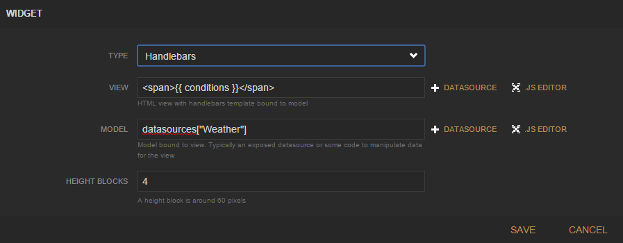

Freeboard Handlebars Widget Plugin
===================================

This is a widget plugin for [Freeboard](http://freeboard.io) (open source web ui dashboard) that allows dashboard widget authoring using [Handlebars](http://handlebarsjs.com) templates.  It is very similar to the built-in HTML widget, but supports a better model/view separation so that Freeboard datasources or other JavaScript data can be bound to a specified view.




### Basic Example

##### View

```
<h1>{{ title }}</h1>
<div>{{ body }}</div>
```

##### Model

`return { title: 'My New Post', body: 'This is my first post!' };`


### Datasource Example

Assuming you have an Open Weather Map API datasource setup named 'Weather'

##### View

```
<span>{{ conditions }}</span>
```

##### Model

`datasources["Weather"]`


### Helpers Example

##### Helpers

```
return {
  fullName: function (person) {
    return person.firstName + ' ' + person.lastName;
  }
};
```

##### View

```
<span>{{fullName person}}</span>
```

##### Model

```
{ person: { firstName: 'John', lastName: 'Doe' } }
```